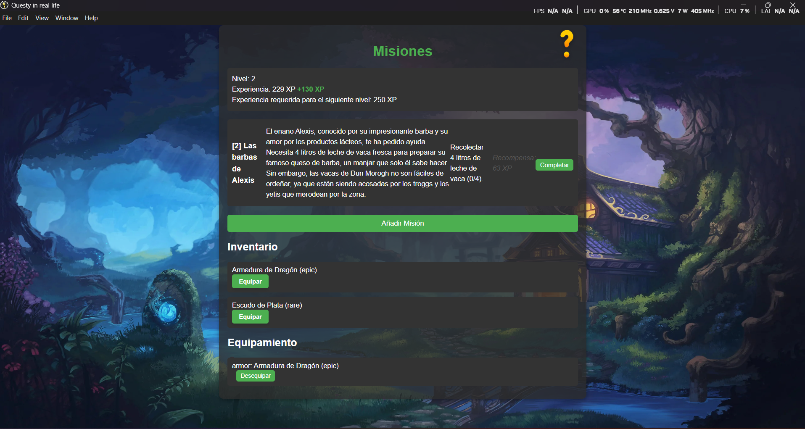

# Questy_irl

**Questy_irl** es una aplicación desarrollada con [Electron](https://www.electronjs.org/) y es un gestor de tareas (TO-DO List) con temática de RPG, más concretamente, World of Warcraft.

## Características

    
  *Captura de pantalla de la interfaz de Questy_irl.*

- **Interfaz de usuario personalizada**: Utiliza `index.html` y `styles.css` para definir la estructura y el estilo de la aplicación.
- **Lógica**: Implementada en `main.js`, `preload.js` y `renderer.js` para gestionar la funcionalidad de la aplicación.
- **Gestión de dependencias**: Utiliza `package.json` y `package-lock.json` para manejar las dependencias del proyecto.

## Requisitos previos

- [Node.js](https://nodejs.org/) (versión 14 o superior)
- [npm](https://www.npmjs.com/) (generalmente incluido con Node.js)

## Instalación

1. **Clona este repositorio**:

   ```bash
   git clone https://github.com/Nachin7u7/Questy_irl.git
   ```

2. **Navega al directorio del proyecto**:

   ```bash
   cd Questy_irl
   ```

3. **Instala las dependencias**:

   ```bash
   npm install
   ```

## Uso

Para iniciar la aplicación en modo de desarrollo, ejecuta:

```bash
npx electron .
```

Esto iniciará la aplicación de escritorio utilizando Electron.

## Generar un archivo ejecutable (.exe)

Si deseas generar un archivo ejecutable (`.exe`) para Windows, puedes usar `electron-packager`. Sigue estos pasos:

1. **Instala `electron-packager`** como dependencia de desarrollo:

   ```bash
   npm install electron-packager --save-dev
   ```

2. **Genera el ejecutable**:

   Ejecuta el siguiente comando para crear un archivo `.exe`:

   ```bash
   npx electron-packager . --platform=win32 --arch=x64 --out=dist
   ```

   - `.` indica la carpeta actual (donde está tu proyecto).
   - `--platform=win32` especifica que estás creando un ejecutable para Windows.
   - `--arch=x64` indica que es para arquitectura de 64 bits.
   - `--out=dist` define la carpeta de salida (en este caso, `dist`).

   Esto generará una carpeta `dist` con tu aplicación empaquetada y un archivo ejecutable (`.exe`).

3. **Encuentra tu ejecutable**:

   Navega a la carpeta `dist/` y busca el archivo `Questy_irl.exe` dentro de la subcarpeta generada.

## Estructura del proyecto

- `index.html`: Archivo principal que define la estructura de la interfaz de usuario.
- `styles.css`: Archivo de estilos que define la apariencia de la aplicación.
- `main.js`: Script principal que controla el ciclo de vida de la aplicación Electron.
- `preload.js`: Script que se ejecuta antes de que la página web sea cargada en el renderizador.
- `renderer.js`: Script que maneja la lógica específica de la interfaz de usuario.
