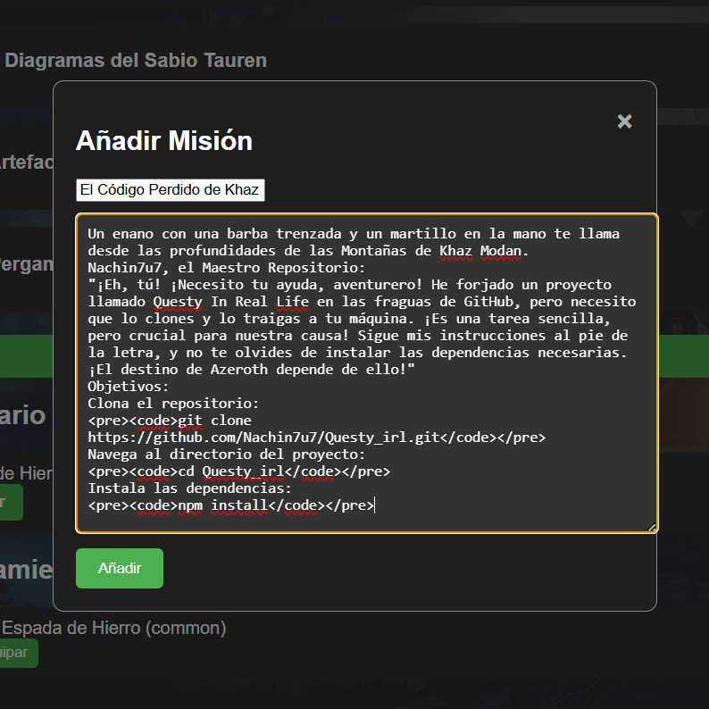

**<h1 align="center">LOK'TAR CAMARADA!</h1>**

# **Questy In Real Life** 🛡️⚔️

**Questy In Real Life** es una aplicación desarrollada con el poder de [Electron](https://www.electronjs.org/), un gestor de tareas (TO-DO List) inspirado en el mundo de *World of Warcraft Classic*. Convierte tus tareas diarias en misiones épicas y lleva un registro de tus logros como si fueras un verdadero héroe de Azeroth.

---

## **Características de la Aventura** 🌟

  
*Una visión de la interfaz de Questy In Real Life, donde las misiones cobran vida.*

- **Interfaz de usuario personalizada**: Forjada en las fraguas de `index.html` y `styles.css`, esta aplicación tiene un diseño único que te transportará a las tierras de Azeroth.
- **Lógica poderosa**: Implementada en `main.js`, `preload.js` y `renderer.js`, la magia que impulsa esta aplicación garantiza que tus misiones estén siempre bajo control.
- **Gestión de dependencias**: Con `package.json` y `package-lock.json`, todas las herramientas necesarias para tu aventura están al alcance de tu mano.

---

## **Requisitos Previos** 🧙‍♂️

Antes de embarcarte en esta aventura, asegúrate de tener lo siguiente:

- **[Node.js](https://nodejs.org/)** (versión 14 o superior): El mana necesario para ejecutar la aplicación.
- **[npm](https://www.npmjs.com/)** (generalmente incluido con Node.js): El herrero que forjará tus herramientas.

---

## **Instalación** 🛠️

Sigue estos pasos para preparar tu equipo y comenzar tu aventura:

1. **Clona este repositorio**:

   ```bash
   git clone https://github.com/Nachin7u7/Questy_irl.git
   ```

2. **Navega al directorio del proyecto**:

   ```bash
   cd Questy_irl
   ```

3. **Instala las dependencias**:

   ```bash
   npm install
   ```

---

## **Uso** 🎮

Para iniciar la aplicación y comenzar tu aventura, ejecuta el siguiente comando:

```bash
npx electron .
```

Esto invocará la aplicación de escritorio utilizando el poder de Electron. ¡Prepárate para gestionar tus misiones como un verdadero campeón de Azeroth!

---

## **Forjar un Ejecutable (.exe)** ⚒️

Si deseas crear un archivo ejecutable (`.exe`) para Windows, puedes usar `electron-packager`. Sigue estos pasos para forjar tu propia versión portátil de Questy In Real Life:

1. **Instala `electron-packager`** como dependencia de desarrollo:

   ```bash
   npm install electron-packager --save-dev
   ```

2. **Genera el ejecutable**:

   Ejecuta el siguiente comando para crear un archivo `.exe`:

   ```bash
   npx electron-packager . --platform=win32 --arch=x64 --out=dist
   ```

   - `.` indica la carpeta actual (donde está tu proyecto).
   - `--platform=win32` especifica que estás creando un ejecutable para Windows.
   - `--arch=x64` indica que es para arquitectura de 64 bits.
   - `--out=dist` define la carpeta de salida (en este caso, `dist`).

   Esto generará una carpeta `dist` con tu aplicación empaquetada y un archivo ejecutable (`.exe`).

3. **Encuentra tu ejecutable**:

   Navega a la carpeta `dist/` y busca el archivo `Questy_irl.exe` dentro de la subcarpeta generada.

---

## **Formato de las Descripciones de Misiones** 📜

En **Questy In Real Life**, las descripciones de las misiones no son simples líneas de texto. ¡Son pergaminos dinámicos que cobran vida! El sistema reconoce automáticamente títulos, subtítulos y párrafos, aplicando estilos y colores para que tus misiones se vean épicas desde el primer momento.

### **Formato Básico**
Al insertar el título de la misión en el recuadro de descripción, el sistema aplica un formateo predeterminado:
- **Títulos**: Se muestran en un tamaño grande y con un color destacado.
- **Párrafos**: Se muestran en un tamaño estándar con un color fácil de leer.
### **Embellece tus Misiones con HTML** 🎨
Si deseas darle un toque extra de magia a tus misiones, puedes usar **HTML** para personalizar el formato. El sistema es compatible con etiquetas básicas de HTML, lo que te permite añadir estilos, colores y estructuras avanzadas. Aquí tienes un ejemplo de cómo puedes usar HTML para mejorar tus descripciones:

### **Ejemplo Visual** 🖼️
Aquí tienes una muestra de cómo se vería una misión formateada con HTML:

<div align="center">

</div>  
*Una visión de cómo el HTML puede transformar tus misiones en verdaderas obras de arte.*

### **Consejo del Escriba** 🧙‍♂️
"Usa el poder del HTML para darle vida a tus misiones. Con un poco de magia, puedes crear descripciones que inspiren a los héroes a completar sus tareas. ¡No temas experimentar con colores y estilos!"

---

## **Estructura del Proyecto** 🏰

- `index.html`: El pergamino que define la estructura de la interfaz de usuario.
- `styles.css`: Las runas que otorgan estilo y apariencia a la aplicación.
- `main.js`: El grimorio que controla el ciclo de vida de la aplicación Electron.
- `preload.js`: El hechizo que se ejecuta antes de que la página web sea cargada en el renderizador.
- `renderer.js`: El conjuro que maneja la lógica específica de la interfaz de usuario.

---

## **Contribuir** 🤝

Si deseas unirte a esta aventura y contribuir al desarrollo de Questy In Real Life, ¡eres bienvenido! Sigue estos pasos:

1. Haz un *fork* de este repositorio.
2. Crea una nueva rama (`git checkout -b nueva-mision`).
3. Realiza tus cambios y haz un *commit* (`git commit -am 'Añadir nueva misión'`).
4. Haz un *push* a la rama (`git push origin nueva-mision`).
5. Abre un *Pull Request* y describe tus cambios.

---

## **Créditos** 🏅

- **Desarrollador Principal**: [Nachin7u7](https://github.com/Nachin7u7) 🧙‍♂️
- **Inspiración**: World of Warcraft Classic 🐉
- **Herramientas**: Electron, Node.js, npm ⚔️

---

## **Licencia** 📜

Este proyecto está bajo la licencia [MIT](LICENSE). ¡Usa este poder con sabiduría!

---

¡Que los vientos de Azeroth guíen tu camino, héroe! 🌬️✨

---

### **Nota del Desarrollador**:
Si encuentras algún *bug* o tienes alguna sugerencia para mejorar Questy In Real Life, no dudes en abrir un *issue* en el repositorio. ¡Juntos haremos de esta aplicación una leyenda! 🛡️